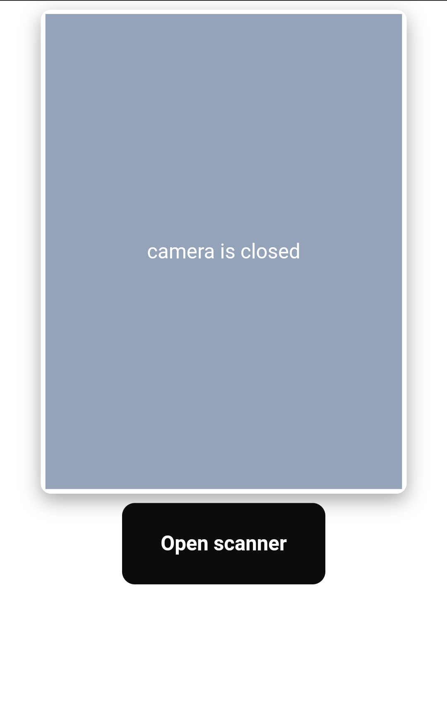
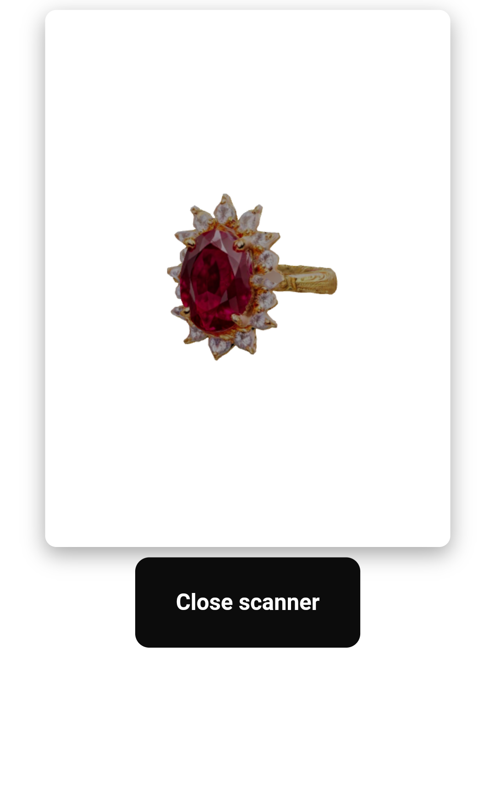

# QR AR Viewer

A web application that combines QR code scanning with Augmented Reality (AR) capabilities. This project allows users to scan QR codes and view associated 3D models or AR content in real-time.

## Live Demo

Live Demo: [QR & AR Viewer](https://qr-ar-viewer.vercel.app)

## Features

- QR code scanning using device camera
- AR content viewing and interaction
- Real-time 3D model rendering
- Mobile-friendly interface

## Screenshots

<em>QR Code Scanning Interface</em>

<em>3D Model in AR View</em>

## Technologies

- HTML5/CSS3/JavaScript
- WebXR API for AR functionality
- QR code scanning library
- Three.js for 3D rendering

## Getting Started

1. Clone the repository
2. Install dependencies using `npm install`
3. Run the development server with `npm start`
4. Access the application through a WebXR-compatible browser

## Usage

Simply point your device's camera at a compatible QR code to view the associated AR content.
Here is the sample QR:

## Requirements

- Modern web browser with WebXR support
- Device with camera access
- Internet connection
